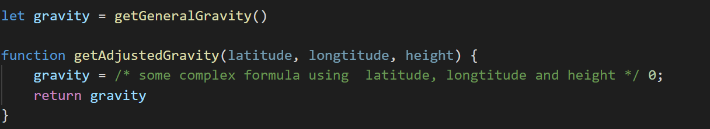

## 5주차 : 기능 이동
--------------------------------------------------
1. Js pipe 이용하여 반복문을 파이프라인으로 바꾸기
* [제출한 답 코드 링크](https://jsfiddle.net/mjyxe1p8/)
--------------------------------------------------
2. 아래 코드에서 문제점을 찾아, 그 문제가 무엇인지 설명하고, 간략하게 해결책을 설명 하시오.

     ``(과제조건) 본 코드에서는 gravity  = 0 이 할당되고 있지만, vscode의 빨간줄을 막기 위해 임의로 넣어둔 식이며, 실제로는 저 자리에 latitude, longtitude, height를 이용한 굉장히 복잡한 수식이 들어간다고 가정 할 것``

* gravity 변수에서 호출되는 getGeneralGravity()함수가 가까이 있지 않고 타 함수가 변수 바로 밑에 위치하고 있다.
 뿐만 아니라 변수를 중복하여 사용하고 있기 때문에 어느 시점에 어느 함수가 호출되어 값이 할당되었는지 혼동될 수 있다. 하나의 변수는 하나의 용도로만 사용되도록 한다.
  해결책 
 요소를 선언하는 곳과 사용하는 곳을 가까이 둔다. 
 getGeneralGravity함수를 gravity 변수 밑에 두어 관련 있는 함수임이 잘 나타나게 슬라이드하고, getAdjustedGravity함수를 해당 함수를 처음 호출하는 곳 근처로 이동시킨다.
  getAdjustedGravity함수에서 사용되는 변수는 따로 선언하여 구분될 수 있도록 리팩터링한다.
--------------------------------------------------
3. 아래 링크의 코드를 리팩터링하시오 (리팩토링 실습)
* [제출한 답 코드 링크](https://jsfiddle.net/n2eazhqw/
)
--------------------------------------------------
4. 글자제한 없이 아래의 문제에 대해서 자유롭게 작성해주세요.
	1.	8장의 기법들과 관련하여 저자의 견해에 반대하는 부분이 있다면 반박하시오.
	2.	만일 없다면, 기존에  자신이 가지고 있던 코딩 지향과 다른 지점이 있다면 실제 경험을 예시로 들어 설명하시오.
	3.	만일 그것도 없다면, 자신의 코딩 지향과 잘 맞는 부분을 실제 경험을 예시로 설명하시오.

* 해당 챕터에서는 저자의 견해에 반대하거나 의문을 가지는 부분이 딱히 없었다. 오히려 정말 잘 숙지하여 앞으로 실무에서 잊지 말고 반영 해야겠다고 느끼는 지점이 많았다. 
반복문 쪼개기는 평소에 인지하지 못하는 냄새였어서 반성을 했다. 한번의 순환으로 해결될 수 있다면 코드를 줄이고 성능 향상을 위해 같이 두었던 적이 많았던 것 같다. 하지만 책을 읽고 나니 코드의 가독성과 유지/보수의 용이성을 위해서는 분명 나누는게 맞다는 생각이 들었다. 
  파이프라인 도입은 개인적인 코드 지향점과 일치한다. ES6 문법이 나온 후 JS 개발이 정말 우아해졌다. 신입 때 프론트엔드 개발을 잠깐 맡았었는데 그 때 일급함수, 람다, 파이프라인 등을 처음 접하고 신세계라고 느꼈다. (물론 자바8에서 람다와 이터레이터가 등장했지만 실무에서 많이 사용 되지 않아서 인지하지 못했었다.)
 아무튼 프론트엔드 개발 당시 for문을 사용할 일이 거의 없었고, 대부분 파이프라인으로 해결했다. 만약 바닐라js에 없는 파이프라인 연산자라면 함수형프로그래밍을 위한 함수를 따로 만들어서 반영하기도 했다. 
정말 가독성 좋고 코드가 세련되게 느껴졌다. 

